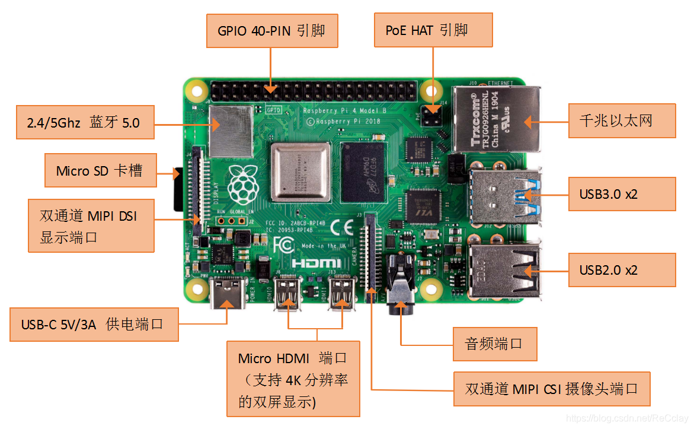
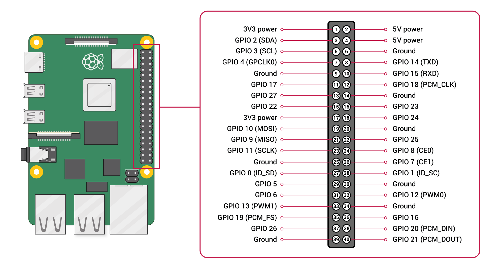

# 【开发板名称】树莓派4b

****

**版本特性**

- 适配GPU
- 适配usb相机

**一、搭建开发环境**

**1、安装依赖工具**

Linux虚拟机或真机安装命令如下：

```
sudo apt update&&sudo apt install -y git git-lfs curl python3 python3-pip default-jdk device-tree-compiler cpio bison ccache ruby flex libtinfo5 xorg-dev libssl-dev bc dosfstools mtools
```

推荐使用docker：
拉取以下镜像（基于ubuntu20.04）即可跳转到repo init继续操作
```
docker run -it d1124/ohosenv:pu
```
推荐使用-v命令挂载：
```
docker run -v rpi:/ohos -it d1124/ohosenv:pu
```
如果不使用以上镜像则需要安装以下依赖：
```
apt update&&apt-get install -y git git-lfs curl python3 python3-pip default-jdk device-tree-compiler cpio bison ccache ruby flex libtinfo5 xorg-dev libssl-dev bc dosfstools mtools
```

**说明：** 
以上安装命令适用于Ubuntu20.04，其它版本请根据安装包名称采用对应的安装命令。

**2、获取标准系统源码**

**前提条件**

1）注册码云gitee账号并配置用户信息
```
git config --global user.name "yourname"

git config --global user.email "your-email-address"
```

2）安装码云repo工具，可以执行如下命令。

```
curl https://gitee.com/oschina/repo/raw/fork_flow/repo-py3 | sudo tee /usr/local/bin/repo >/dev/null &&sudo chmod a+x /usr/local/bin/repo &&sudo ln -sf bash /bin/sh
```

**获取源码操作步骤**

通过repo + https 下载。
注意：repo init不能在系统根目录下执行

```
repo init -u https://gitee.com/isrc_ohos/device_board_rpi.git -b OpenHarmony-5.0-Release  --no-repo-verify

repo sync -c

repo forall -c 'git lfs pull'
```

**执行prebuilts**

在源码根目录下执行脚本，安装编译器及二进制工具。

```
./build/prebuilts_download.sh
```


**二、编译和烧录**

**1、编译**

在Linux环境进行如下操作:

进入源码根目录，执行如下命令进行版本编译。
第1步：执行编译前的脚本
```
chmod 777 device/board/rpi/system_patch/system_patch.sh
device/board/rpi/system_patch/system_patch.sh
```
第2步：编译系统镜像
```
./build.sh --product-name rpi4 --ccache
```
第2步：对系统镜像打包
```
./build.sh --product-name rpi4 --ccache --build-target rpi_image
```


编译所生成的文件都归档在out/rpi4/目录下，结果镜像输出在
out/rpi4/packages/phone/images/ 目录下。

3） 编译源码完成，请进行镜像烧录。

**2、烧录工具**

烧录需要用到至少16G的TF卡和一个读卡器。

首先使用SDCardFormatter格式化TF卡，之后使用Win32DiskImager烧写out/rpi4/packages/phone/images/路径下的rpi_image.img文件。

[SDCardFormatter](https://www.sdcardformatter.com/download/)

[Win32DiskImager](https://win32diskimager.org/#download)

**三、调试**

**1、连接串口**

串口引脚图如下：
****
1、连接图中6、8、10三个引脚。
2、打开Xshell，新建会话，在连接的协议中选择SERIAL。
3、转到串口标签，选择正确的端口号，波特率115200，完成后即可连接。


**3、使用HDC工具**

使用HDC工具(命令)：
```

hdc连接：插入网线获取到设备ip地址，在电脑命令行中输入hdc tconn 设备ip地址：5555，输出Connect OK即连接成功。

(1)hdc shell:进入命令行
(2)hdc file send {本地系统文件路径} {oh系统文件路径}:发送文件
(3)hdc file recv {oh系统文件路径} {本地系统文件路径}:接收文件
(4)hdc install XXX.hap:安装hap包
```

**四、联系**

[Dy](https://gitee.com/d1124)
[Diemit](https://gitee.com/diemit)


